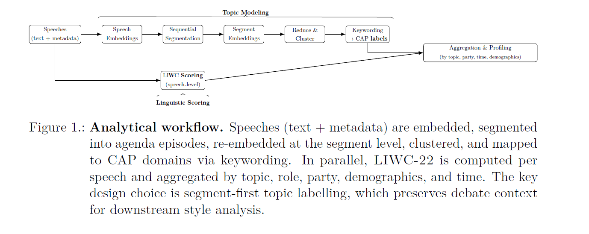
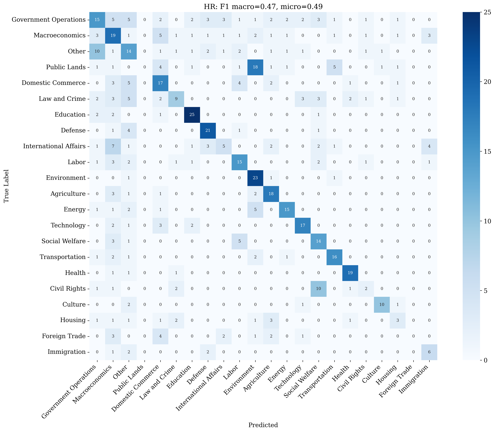

# Beyond the Speech: Context-Aware Topic Labelling and Linguistic Style in Parliamentary Debates

**Master's Thesis Repository**

Parliamentary debates are turn-taking, agenda-driven sequences, but most text-as-data methods treat speeches as isolated documents. This repository implements a **segment-first, context-aware pipeline** that segments parliamentary sittings into coherent agenda episodes, embeds and clusters segments, maps clusters to Comparative Agendas Project (CAP) domains, and profiles linguistic style with LIWC-22. The goal is **interpretable, scalable monitoring** of "what parliament was talking about" over time and across countries.

---

## Dataset

**ParlaMint v5.0 Parliamentary Debates**

- **Total speeches**: ~1.4M across three countries
- **Countries & coverage**:
  - **Austria (AT)**: 231,759 speeches (1996–2022)
  - **Croatia (HR)**: 504,338 speeches (2003–2022)
  - **Great Britain (GB)**: 670,912 speeches (2015–2022)
- **Unit of analysis**: Agenda episodes / debate segments (not isolated speeches)
- **Languages**: Native + English machine translation (AT, HR); native English (GB)

ParlaMint corpus: [CLARIN.si repository](https://www.clarin.si/repository/xmlui/handle/11356/2006)

---

## Pipeline


*Figure 1: Four-stage context-aware pipeline from raw debates to interpretable topic and style profiles.*

### Stage 1: Sequential Segmentation (Agenda Episode Detection)

Combine two signals to detect episode boundaries:

**(a) Semantic similarity drops**
- Compute BGE-m3 embeddings for each speech
- Use rolling windows to detect cosine similarity drops (95th percentile threshold)

**(b) Chairperson agenda cues**
- Language-specific keyword lists (e.g., "agenda", "next item", "point [number]")
- Accept keyword boundary **only if** it aligns with a semantic shift (±3 speeches)
- Otherwise rely on semantic boundaries alone

**Parameters**:
- Minimum segment length: 5 speeches
- Window size `k`: auto-optimized per country on sample using composite score (keyword alignment + within-segment coherence + between-segment separation)

### Stage 2: Embeddings

**Model**: BAAI/bge-m3 (multilingual, 8192 token window, 1024-d output)

**Chunking strategy**:
- Long texts → overlapping chunks (~25% overlap) → average embeddings
- Speech-level overflow rare (~0.01%), but **segment-level overflow common (13–23%)**
- For AT/HR: compute embeddings for **native + English MT** for cross-lingual consistency checks
- LIWC analysis uses English MT

### Stage 3: Clustering + CAP Mapping

**Dimensionality reduction**: UMAP
- Metric: cosine
- Typical settings: `n_neighbors=15`, `n_components=10`, `min_dist=0.05`

**Clustering**: Gaussian Mixture Model (GMM)
- Soft assignments; handles elliptical clusters
- Number of clusters chosen by scanning range, optimizing Silhouette + interpretability
  - **AT**: 180 clusters
  - **GB**: 170 clusters
  - **HR**: 185 clusters

**CAP domain mapping**:
- Represent clusters with c-TF–IDF keywords (unigrams + bigrams)
- Map each subtopic to exactly one CAP domain via conservative LLM prompt (GPT-4o-mini, temperature 0)
- Allow "Other/Mix" when uncertain

**CAP domains** (23 categories): Macroeconomics, Civil Rights, Health, Agriculture, Labour, Education, Environment, Energy, Immigration, Transportation, Law & Crime, Social Welfare, Housing, Domestic Commerce, Defence, Technology, Foreign Trade, International Affairs, Government Operations, Public Lands, Culture, State & Local Government Issues, Other/Mix.

### Stage 4: LIWC-22 Style Profiling

**Scoring**:
- Score speeches with LIWC-22 software
- For AT/HR: score English MT (recommended over ad-hoc non-English dictionaries)

**Normalization**:
- Convert LIWC category percentages to z-scores using LIWC's Test Kitchen Corpus norms (mean/std)
- Generate both raw z-score heatmaps and **difference heatmaps** (e.g., macroeconomics minus others; coalition minus opposition)

---

## Evaluation Philosophy

**Why episode-level coherence matters**:
- System designed for **agenda episode coherence**, not isolated utterances
- Utterance-level F1 against context-free labels **underestimates practical usefulness**
- Supervised classifiers can score higher on utterance tests, but this repo targets **episode monitoring and interpretability**

**Evaluation benchmarks**:

1. **ParlaCAP automatic labels** (full corpora)
   - Noisy, utterance-level reference
   - **Performance**: macro-F1 ≈ 0.47–0.55; micro-F1 ≈ 0.51–0.57

2. **Human test sets** (GB, HR)
   - Balanced, mid-length speeches; no chair turns
   - Annotated in isolation (context-blind)
   - **Performance**: macro-F1 ≈ 0.43 (GB), 0.47 (HR)

**Error patterns**:
- Confusions mostly between **adjacent CAP domains** (macro ↔ commerce; welfare ↔ health; international affairs ↔ trade)
- Consistent with boundary/mixed episodes rather than random errors


*Figure 2: Confusion matrix (HR vs human test set). Errors cluster along diagonal/adjacent domains, reflecting episode boundaries.*

---

## Key Findings

### Topic-Specific Linguistic Style (Cross-Country Stable)

**Macroeconomics**:
- Strong overuse of money vocabulary
- Higher authority/Clout markers
- Lower moral/insight language vs other domains

**Health**:
- Lower politic/power markers
- Slightly higher Tone (less adversarial)


*Figure 3: LIWC difference heatmaps. Macroeconomics (top) vs Health (bottom) compared to other domains.*

### Coalition vs Opposition Style (Cross-Country)

**Coalition**:
- More positive tone
- More collective language ("we")

**Opposition**:
- More overt political/power vocabulary
- More direct address


*Figure 4: Coalition vs Opposition LIWC differences (pooled across countries).*

### Temporal Agenda Dynamics

**Crisis substitution**:
- Health rises during COVID-19 as Macroeconomics falls
- Budget-cycle bumps in Macroeconomics (especially AT, GB)

**External shocks**:
- International Affairs spikes around migration crisis, Ukraine war
- Defence more episodic


*Figure 5: Macroeconomics vs Health over time with crisis markers (AT, GB, HR).*

### Cross-Lingual Embedding Consistency (AT, HR)

- Native vs English-MT embeddings cluster with high similarity (means ~0.86 AT, ~0.84 HR)
- Similarity increases mildly with length
- Supports English-based LIWC pipeline


*Figure 6a: Cosine similarity between native and English-MT embeddings (Austria).*


*Figure 6b: Cosine similarity between native and English-MT embeddings (Croatia).*

---

## Repository Structure

```
master-thesis/
├── code/
│   ├── 01_segmentation.ipynb          # Agenda episode detection
│   ├── 02_embeddings.ipynb            # BGE-m3 speech & segment embeddings
│   ├── 03_clustering_cap.ipynb        # UMAP + GMM + CAP mapping
│   ├── 04_liwc_profiling.ipynb        # LIWC-22 scoring & z-scores
│   └── 05_visualization.ipynb         # Generate all figures
├── data/
│   ├── raw/                           # ParlaMint v5 (not in repo; download separately)
│   └── processed/                     # Intermediate outputs (.pkl, .csv)
├── figures/                           # Generated visualizations
│   ├── pipeline.png
│   ├── confusion/                     # Confusion matrices
│   ├── embedding_quality/             # Cross-lingual embedding analysis
│   ├── liwc_z_scores/                 # LIWC heatmaps and differences
│   ├── temporal_liwc/                 # LIWC over time
│   ├── temporal_party/                # Party/coalition temporal patterns
│   ├── temporal_topic/                # Topic evolution over time
│   └── topic_distribution/            # Topic frequency distributions
├── outputs/                           # Final tables & statistics
└── README.md
```

---

## Reproducing Results

### 1. Setup

**Install dependencies**:
```bash
pip install pandas numpy torch sentence-transformers scikit-learn
pip install bertopic umap-learn hdbscan openai python-dotenv tqdm
pip install matplotlib seaborn openpyxl
```

**Download data**:
- Get ParlaMint v5.0 from [CLARIN.si](https://www.clarin.si/repository/xmlui/handle/11356/2006)
- Download: `ParlaMint-{AT,HR,GB}` + `ParlaMint-{AT,HR}-en.ana` (English MT)
- Place in `data/raw/`

**Configure**:
- Set `OPENAI_API_KEY` in `.env` (for CAP mapping)
- Update paths in each notebook (`BASE_DATA_DIR`, `OUTPUT_DIR`)

### 2. Run Pipeline

Execute notebooks in order:

| Step | Notebook | Runtime | Output |
|------|----------|---------|--------|
| 1. Segmentation | `01_segmentation.ipynb` | ~2–4h per country | `{AT,HR,GB}_segments.pkl` |
| 2. Embeddings | `02_embeddings.ipynb` | ~6–8h per country | `{AT,HR,GB}_embeddings.pkl` |
| 3. Clustering + CAP | `03_clustering_cap.ipynb` | ~1–2h per country | `{AT,HR,GB}_topics_cap.pkl` |
| 4. LIWC Profiling | `04_liwc_profiling.ipynb` | ~30min per country | `{AT,HR,GB}_liwc_zscores.pkl` |
| 5. Visualization | `05_visualization.ipynb` | ~30min | `figures/*/*.png` |

### 3. Generated Figures

| Figure Category | Script | Output Folder |
|-----------------|--------|---------------|
| Pipeline diagram | Manual (thesis) | `figures/pipeline.png` |
| Confusion matrices | `05_visualization.ipynb` | `figures/confusion/` |
| Embedding quality | `05_visualization.ipynb` | `figures/embedding_quality/` |
| LIWC z-scores & differences | `05_visualization.ipynb` | `figures/liwc_z_scores/` |
| LIWC temporal patterns | `05_visualization.ipynb` | `figures/temporal_liwc/` |
| Party/coalition patterns | `05_visualization.ipynb` | `figures/temporal_party/` |
| Topic evolution | `05_visualization.ipynb` | `figures/temporal_topic/` |
| Topic distributions | `05_visualization.ipynb` | `figures/topic_distribution/` |

---

## Requirements

- **Python**: 3.8+
- **GPU**: Recommended (16GB+ VRAM for embeddings)
- **Memory**: 32GB+ RAM (for large segment clustering)
- **LIWC-22**: Separate license required ([liwc.app](https://www.liwc.app))
- **OpenAI API**: For CAP domain mapping (GPT-4o-mini)

---

## Data Access

- **ParlaMint v5.0**: External corpus; download from [CLARIN.si](https://www.clarin.si/repository/xmlui/handle/11356/2006)
- **Repository**: Stores code and processing artifacts, not raw corpus
- **Processed outputs**: Available on request (contact author)

---

## Notes

- **Sequence matters**: Episode-level coherence is key for monitoring tasks
- **Cross-country comparability**: Multilingual embeddings + CAP standardization
- **Interpretability**: c-TF–IDF keywords + conservative LLM mapping + LIWC style profiles
- **Limitations**: Human test sets are context-blind; episode-aware evaluation remains challenging

---

## Citation

```bibtex
[Add your thesis citation here]
```

**Author**: Pavle Savkovic  
**Year**: 2025

---

## License

[Specify license, e.g., MIT, CC-BY-4.0]


