# Beyond the Speech: Context-Aware Topic Labelling and Linguistic Style in Parliamentary Debates

Master's thesis, Graz University of Technology (MSc Computational Social Systems), 2026. Supervised by Stefan Thalmann and Denis Helic.

## At a glance

This repository implements an end-to-end, multilingual NLP pipeline over 1,407,009 parliamentary speeches from ParlaMint v5.0: Austria (German, 1996–2022), Croatia (Croatian, 2003–2022) and Great Britain (English, 2015–2022), with English machine translation alongside the native text for AT and HR. Instead of labelling speeches one at a time, each sitting is first segmented into agenda episodes (chair agenda cues plus semantic-similarity drops over BGE-m3 embeddings); episodes are embedded, reduced with UMAP, clustered with a Gaussian Mixture Model, and mapped to Comparative Agendas Project (CAP) policy domains by GPT-4o-mini reading each cluster's keywords, while linguistic style is profiled with LIWC-22. Against speech-level references the pipeline reaches macro-F1 0.47–0.55 (ParlaCAP labels) and 0.43–0.47 (context-blind human test sets), a deliberate trade-off for episode-level coherence that the [evaluation section](#evaluation-philosophy) explains. The episode labels support findings that hold across all three countries: Macroeconomics debate is consistently money-heavy and less moralised, institutional role (coalition vs. opposition) shapes style more than ideology, gender or age, and crises such as COVID-19 temporarily shift attention from Macroeconomics to Health before it returns to baseline.

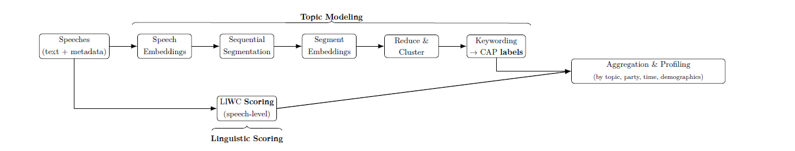
*Figure 1: Segment-first workflow. Topics are assigned to agenda episodes, not isolated speeches; LIWC-22 runs per speech and is aggregated by topic, role, party, demographics and time.*

---

## Dataset

**ParlaMint v5.0 parliamentary debates** ([CLARIN.si](https://www.clarin.si/repository/xmlui/handle/11356/2006))

| Country | Period | Speeches | Languages |
|---|---|---|---|
| Austria (AT) | 1996–2022 | 231,759 | German + English MT |
| Croatia (HR) | 2003–2022 | 504,338 | Croatian + English MT |
| Great Britain (GB) | 2015–2022 | 670,912 | English |
| **Total** | | **1,407,009** | |

Unit of analysis: agenda episodes (debate segments), not isolated speeches.

---

## Pipeline

### Stage 1: Sequential segmentation (agenda episode detection)

Two signals detect episode boundaries:

**(a) Semantic similarity drops**
- BGE-m3 embedding for each speech
- Compare mean embeddings of the `k` speeches before and after each position; boundaries are drops in the top 5% (95th percentile) of the sitting's similarity-drop distribution

**(b) Chairperson agenda cues**
- Language-specific keyword lists (e.g., "agenda", "next item", "point [number]")
- A keyword boundary is kept **only if** a semantic boundary occurs within ±3 speeches; semantic boundaries are kept directly

**Parameters**:
- Window size `k`: tested from 1 to 10 and chosen per country on a sample of 20% of sittings (min 10, max 50) using a composite score (keyword alignment + within-segment coherence + between-segment separation)
- Sittings with fewer than 5 speeches are left unsplit

### Stage 2: Embeddings

**Model**: BAAI/bge-m3 (multilingual, 8192-token window, 1024-d output)

- Long texts are split into overlapping chunks (~25% overlap) and the chunk embeddings averaged
- Speech-level overflow is rare (~0.01%), but **segment-level overflow is common (13–23%)**
- For AT/HR, embeddings are computed for **native text and English MT** to check cross-lingual consistency; LIWC uses the English MT

### Stage 3: Clustering and CAP mapping

**Dimensionality reduction**: UMAP (cosine metric, `n_neighbors=15`, `n_components=10`, `min_dist=0.05`)

**Clustering**: Gaussian Mixture Model (soft assignments, elliptical clusters), plugged into BERTopic in place of HDBSCAN. The number of clusters is chosen by scanning 150–250 and maximising the silhouette score:
- **AT**: 180 clusters
- **GB**: 170 clusters
- **HR**: 185 clusters

For AT and HR the cluster count is optimised on the English view and reused for the native view.

**CAP domain mapping**:
- Each cluster is represented by c-TF–IDF keywords (unigrams + bigrams)
- GPT-4o-mini (temperature 0) maps each cluster to exactly one CAP domain with a conservative prompt; "Other/Mix" is allowed when uncertain
- Keyword lists, prompt and model output are logged per cluster, so every label is auditable

**CAP domains** (23 categories): Macroeconomics, Civil Rights, Health, Agriculture, Labour, Education, Environment, Energy, Immigration, Transportation, Law & Crime, Social Welfare, Housing, Domestic Commerce, Defence, Technology, Foreign Trade, International Affairs, Government Operations, Public Lands, Culture, State & Local Government Issues, Other/Mix.

### Stage 4: LIWC-22 style profiling

- Speeches are scored with the LIWC-22 software; for AT/HR the English MT is scored, as recommended by the LIWC-22 developers over ad-hoc non-English dictionaries
- LIWC category percentages are converted to z-scores using LIWC's Test Kitchen Corpus norms (mean/std)
- Results are shown as raw z-score heatmaps and **difference heatmaps** (e.g., Macroeconomics minus other topics; coalition minus opposition)

---

## Evaluation Philosophy

**Why episode-level coherence matters**:
- The system is designed for **agenda episode coherence**, not isolated utterances
- Utterance-level F1 against context-free labels **underestimates practical usefulness**: a short speech can look off-topic in isolation and still clearly belong to the ongoing episode
- Supervised classifiers score higher on utterance tests (ParlaCAP reports GPT-4o macro-F1 of 0.761 for GB and 0.657 for HR on the same human tests), but this repository targets **episode monitoring and interpretability**

**Benchmarks**:

| Country | Macro-F1 vs. ParlaCAP (full corpus) | Micro-F1 vs. ParlaCAP (full corpus) | Macro-F1 vs. human test set |
|---|---|---|---|
| Austria (AT) | 0.55 | 0.57 | — |
| Great Britain (GB) | 0.47 | 0.51 | 0.43 |
| Croatia (HR) | 0.52 | 0.56 | 0.47 |

- **ParlaCAP automatic labels**: noisy, utterance-level reference over the full corpora
- **Human test sets** (GB, HR): label-balanced, mid-length speeches, no chair turns, annotated in isolation (context-blind)

**Error patterns**: confusions fall mostly between **adjacent CAP domains** (Macroeconomics ↔ Domestic Commerce, Social Welfare ↔ Health, International Affairs ↔ Foreign Trade). This is consistent with boundary and mixed episodes rather than random errors.

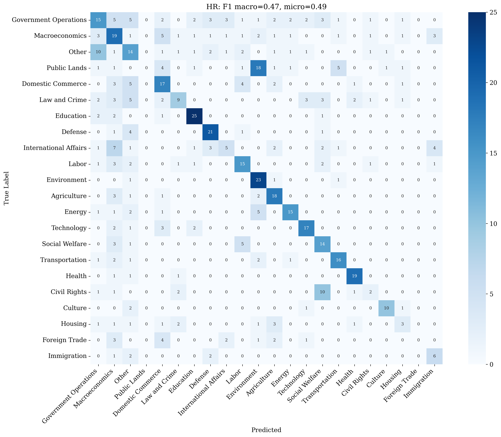
*Figure 2: Confusion matrix, HR vs. human test set. Errors cluster along the diagonal and in adjacent domains, reflecting episode boundaries.*

---

## Key Findings

### Parliamentary language as a baseline

Relative to everyday-language norms, parliamentary speech in all three countries is elevated on `politic` and `power` and low on first-person singular. The topic and role differences below are variation within this institutional register.

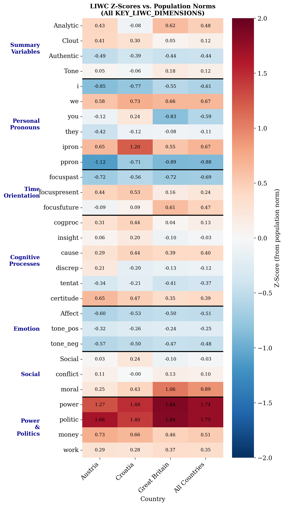
*Figure 3: Country-wise LIWC-22 z-scores relative to the Test Kitchen norms.*

### Topic-specific linguistic style (stable across countries)

**Macroeconomics**:
- Strong overuse of money vocabulary (about 1.4 standard deviations above the rest of the agenda in every country)
- Higher authority/Clout markers
- Lower moral/insight language than other domains

**Health**:
- Lower politic/power markers
- Slightly higher Tone (less adversarial)

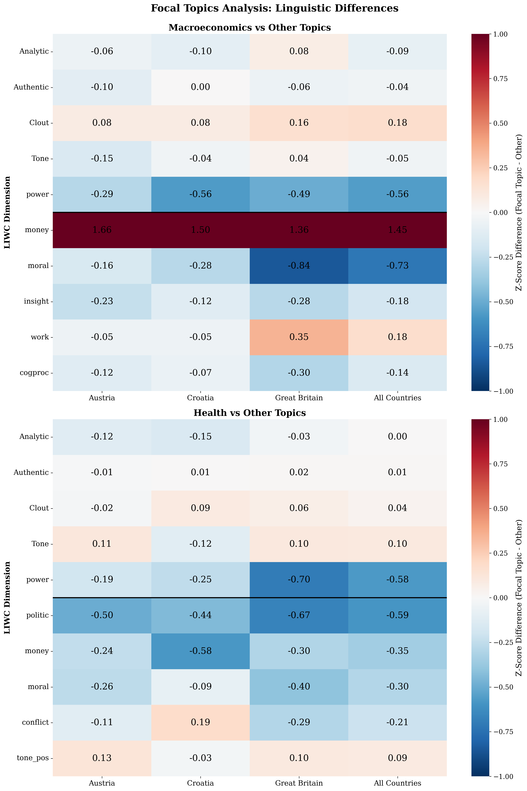
*Figure 4: LIWC difference heatmaps. Macroeconomics (top) and Health (bottom) compared with all other domains.*

### Coalition vs. opposition style (across countries)

**Coalition**:
- More positive tone
- More collective language ("we")

**Opposition**:
- More overt political/power vocabulary
- More direct address

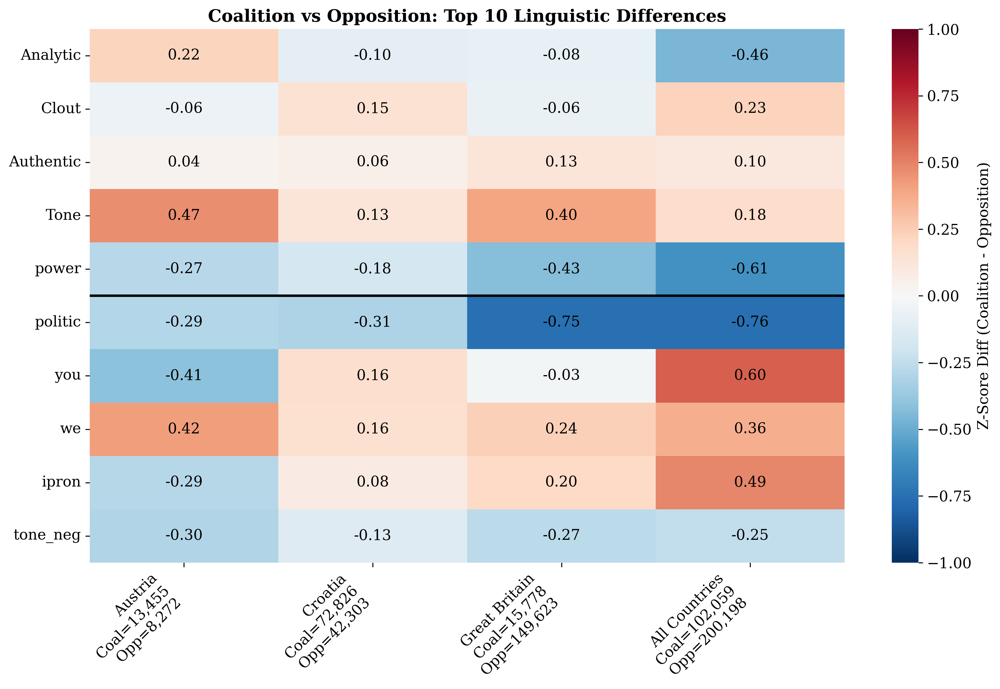
*Figure 5: Coalition minus opposition LIWC differences per country and pooled.*

In Austria, the SPÖ and FPÖ, which alternate between government and opposition, become more positive in tone when they enter government and less positive when they leave; the ÖVP, in government throughout, shows no comparable shift.

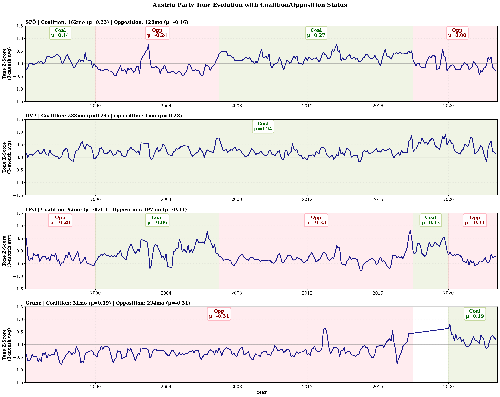
*Figure 6: LIWC-22 Tone by Austrian party (three-month moving average), shaded by each party's time in government and opposition.*

### Role matters more than ideology or demographics

Across the left–right spectrum, parliamentary style is far more stable than across the coalition–opposition divide. Gender and age differences exist but are modest compared with topic and role effects.

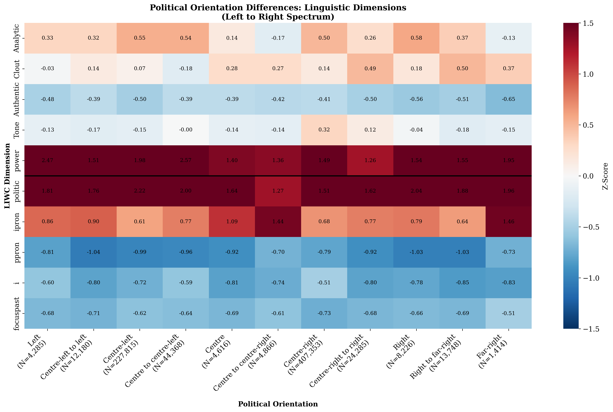
*Figure 7: LIWC-22 z-scores by left–right party position.*

<details>
<summary>Gender and age contrasts</summary>

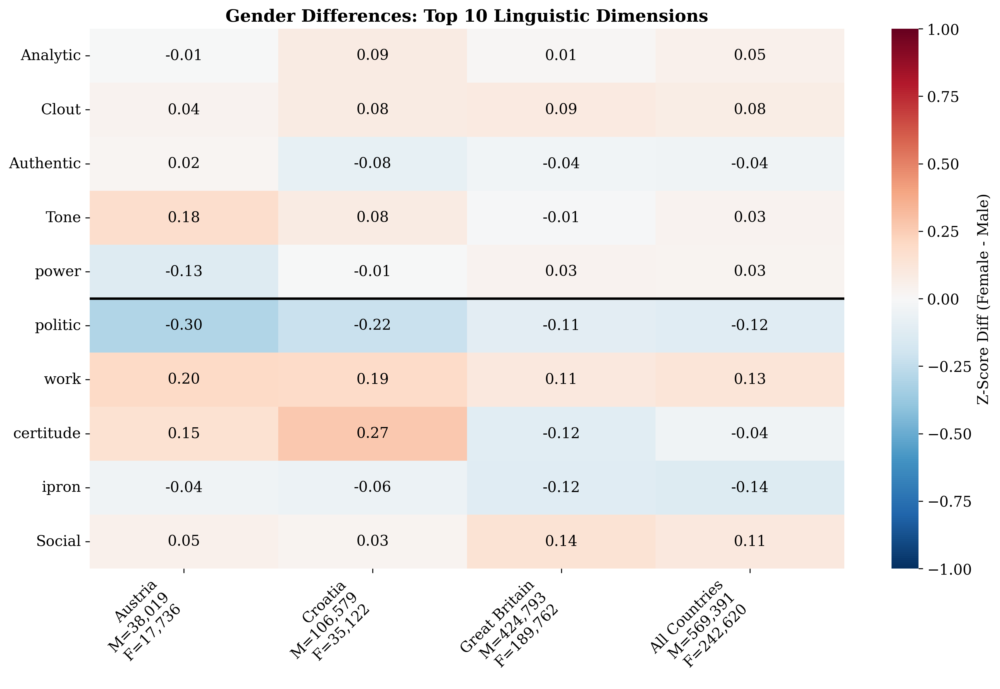
*Women minus men, per country and pooled.*

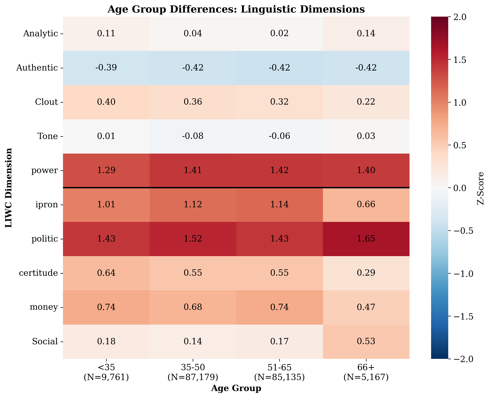
*LIWC-22 z-scores by speaker age group.*

</details>

### Temporal agenda dynamics

**Crisis substitution**:
- Health rises during COVID-19 as Macroeconomics falls
- Budget-cycle bumps in Macroeconomics (especially AT, GB)

**External shocks**:
- International Affairs spikes around the migration crisis and the Ukraine war
- Defence is more episodic

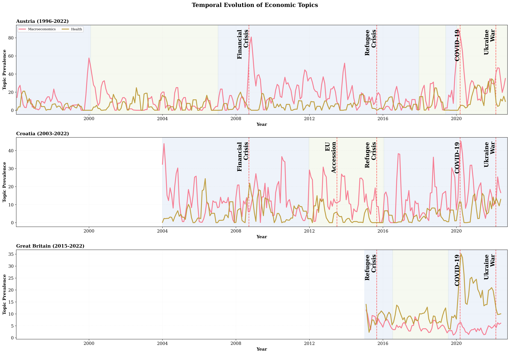
*Figure 8: Macroeconomics vs. Health over time with crisis markers (AT, HR, GB).*

Rhetoric moves in parallel: politically charged language rises during the 2015 migration crisis, COVID-19 and the Ukraine war but does not stay elevated. `politic` spikes and reverts quickly, while `moral` vocabulary settles back more slowly.

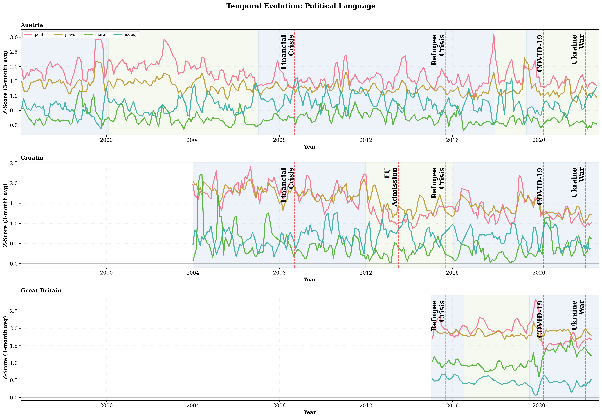
*Figure 9: `politic`, `power`, `moral` and `money` over time (three-month moving average) with crisis markers.*

### Cross-lingual embedding consistency (AT, HR)

- Native and English-MT embeddings of the same speech are highly similar (mean cosine 0.864 AT, 0.839 HR)
- Similarity increases mildly with text length
- This supports running LIWC-22 on the English MT

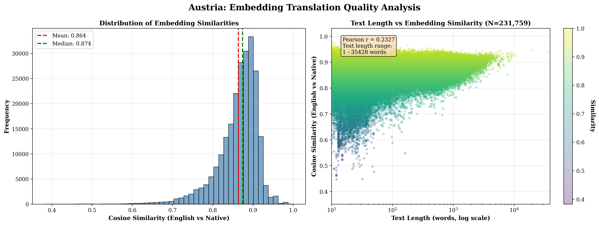
*Figure 10a: Cosine similarity between native and English-MT embeddings, Austria.*

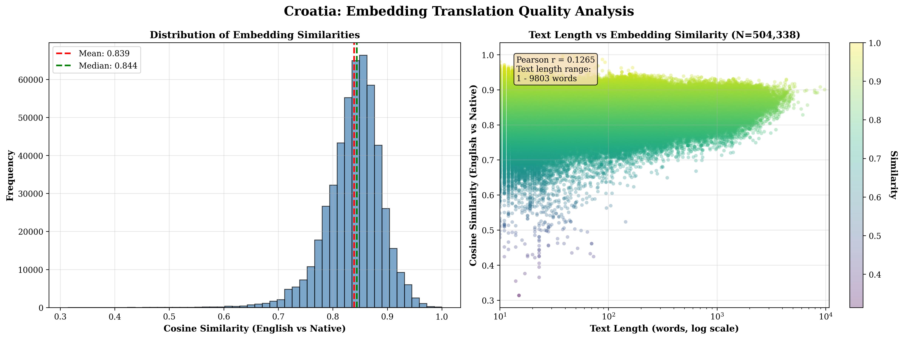
*Figure 10b: Cosine similarity between native and English-MT embeddings, Croatia.*

### More figures

| Folder | Contents |
|---|---|
| [`figures/confusion_matrices/`](figures/confusion_matrices/) | Confusion matrices per country |
| [`figures/topic_distributions/`](figures/topic_distributions/) | Topic shares, pipeline vs. ParlaCAP reference, per country |
| [`figures/liwc_profiles/`](figures/liwc_profiles/) | Topic × LIWC interaction heatmaps (per country and combined), plus the heatmaps above |
| [`figures/liwc_over_time/`](figures/liwc_over_time/) | LIWC-22 categories over time: affect, cognitive, political, pronouns, summary, time orientation |
| [`figures/party_style_over_time/`](figures/party_style_over_time/) | Per-party trajectories (AT, HR) for analytic, anger, anxiety, authentic, moral, sadness, tone |
| [`figures/topic_prevalence_over_time/`](figures/topic_prevalence_over_time/) | Topic prevalence over time: economic, security, social |
| [`figures/cross_lingual_similarity/`](figures/cross_lingual_similarity/) | Cross-lingual embedding similarity (AT, HR) |

---

## Limitations

- Available gold labels are speech-level and context-blind; a fair evaluation of an episode-level method needs episode-level labels, which do not yet exist
- LIWC-22 on English MT may lose idioms and culturally specific nuance, especially in affective and moral categories
- Three European parliaments over limited periods; results describe aggregate patterns, not individual MPs or causal effects

---

## Beyond parliament

The episode-level approach is not specific to parliament. It applies wherever topical structure emerges through interaction rather than being annotated in advance: committee hearings, council meetings, court transcripts, broadcast debates, customer-support conversations, online discussion threads and other multi-party dialogue. In these settings topic boundaries are produced and negotiated in the exchange itself, and combining procedural cues with semantic drift recovers them and assigns coherent discussion-level labels with little manual effort. Applying the pipeline outside parliament has not been evaluated in this work.

---

## Repository Structure

```
master-thesis/
├── notebooks/
│   ├── 01_preprocessing_and_segmentation.ipynb   # Load ParlaMint, speech embeddings, segmentation, segment embeddings
│   ├── 02_topic_modelling_and_cap_mapping.ipynb  # UMAP + GMM clustering, CAP mapping, merge LIWC-22 and reference labels
│   └── 03_evaluation_and_figures.ipynb           # Evaluation, LIWC z-scores, figures
├── data/                                         # Local data, not in the repo (see below)
├── figures/
│   ├── pipeline.png
│   ├── confusion_matrices/
│   ├── cross_lingual_similarity/
│   ├── liwc_over_time/
│   ├── liwc_profiles/
│   ├── party_style_over_time/
│   ├── topic_distributions/
│   └── topic_prevalence_over_time/
├── thesis_savkovic.pdf               # Full thesis
├── paper_savkovic.pdf                # Journal manuscript (under review)
├── thesis_defense_savkovic.pptx      # Defence slides
├── requirements.txt
├── LICENSE
└── README.md
```

---

## Reproducing Results

### 1. Setup

```bash
pip install -r requirements.txt
```

Create a `.env` file with `OPENAI_API_KEY=...` (used for CAP mapping in `02_topic_modelling_and_cap_mapping.ipynb`).

### 2. Data

All notebooks run from `notebooks/` and read from `data/` (gitignored). Expected layout:

```
data/
├── AT/
│   ├── ParlaMint-AT/ParlaMint-AT.txt/                # native text + metadata (year folders)
│   ├── ParlaMint5.0-AT-en.ana/ParlaMint-AT-en.txt/   # English MT
│   └── AT_LIWC_results.csv                           # LIWC-22 output (see Run, step 2)
├── HR/
│   ├── ParlaMint-HR/ParlaMint-HR.txt/
│   ├── ParlaMint5.0-HR-en.ana/ParlaMint-HR-en.txt/
│   ├── HR_LIWC_results.csv
│   └── ParlaCAP-test-hr.jsonl                        # human test set
├── GB/
│   ├── ParlaMint-GB/ParlaMint-GB.txt/
│   ├── GB_LIWC_results.csv
│   └── ParlaCAP-test-en.jsonl                        # human test set
└── LIWC-22.Descriptive.Statistics-Test.Kitchen.xlsx  # LIWC-22 norms
```

- ParlaMint v5.0: [CLARIN.si](https://www.clarin.si/repository/xmlui/handle/11356/2006)
- ParlaCAP human test sets: Kuzman Pungeršek et al. ([arXiv:2602.16516](https://arxiv.org/abs/2602.16516))
- `01_preprocessing_and_segmentation.ipynb` detects Google Colab and then reads from `/content/drive/MyDrive/thesis/data` instead

### 3. Run

| Step | Notebook | Reads | Writes |
|---|---|---|---|
| 1 | `01_preprocessing_and_segmentation.ipynb` | ParlaMint text + metadata | `data/{AT,HR,GB}/{C}_speeches_processed.pkl` |
| 2 | LIWC-22 app (outside this repo) | English text per speech | `data/{AT,HR,GB}/{C}_LIWC_results.csv`, keyed by speech `ID` |
| 3 | `02_topic_modelling_and_cap_mapping.ipynb` | processed pickles, LIWC CSVs, ParlaCAP test sets | `data/{AT,HR,GB}/{C}_final.pkl` |
| 4 | `03_evaluation_and_figures.ipynb` | `*_final.pkl`, LIWC-22 norms | `figures/*/` |

The cross-lingual similarity plots in `figures/cross_lingual_similarity/` are not generated by these notebooks.

### 4. Requirements

- **GPU**: recommended (16 GB+ VRAM for embeddings)
- **Memory**: 32 GB+ RAM (for large segment clustering)
- **LIWC-22**: separate license required ([liwc.app](https://www.liwc.app))
- **OpenAI API**: for CAP domain mapping (GPT-4o-mini)

---

## Data Access

- **ParlaMint v5.0**: external corpus, download from [CLARIN.si](https://www.clarin.si/repository/xmlui/handle/11356/2006)
- **This repository**: code and figures, not the raw corpus
- **Processed outputs**: available on request (contact the author)

---

## Citation

```bibtex
@mastersthesis{savkovic2026beyond,
  author  = {Savkovi{\'c}, Pavle},
  title   = {Beyond the Speech: Context-Aware Topic Labelling and Linguistic Style in Parliamentary Debates},
  school  = {Graz University of Technology},
  address = {Graz, Austria},
  year    = {2026},
  type    = {Master's thesis},
  url     = {https://github.com/pavlesav/master-thesis}
}
```

A journal article based on this thesis (Pavle Savković, Stefan Thalmann, Armin Spök, Denis Helic) is under review at the *Journal of Computational Social Science*; the submitted manuscript is included as [`paper_savkovic.pdf`](paper_savkovic.pdf).

---

## License

Code is released under the [MIT License](LICENSE).
